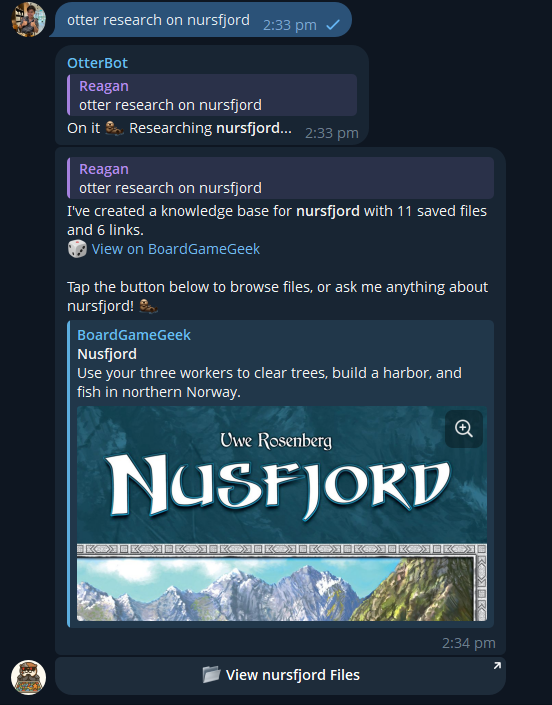
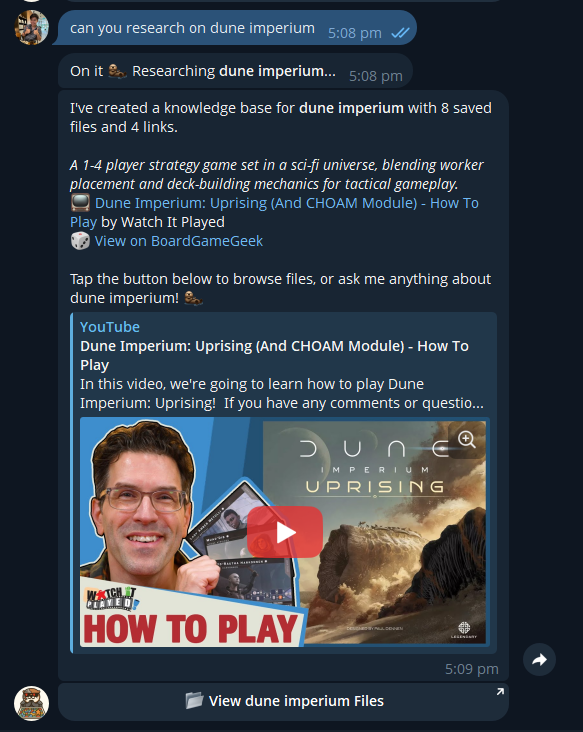
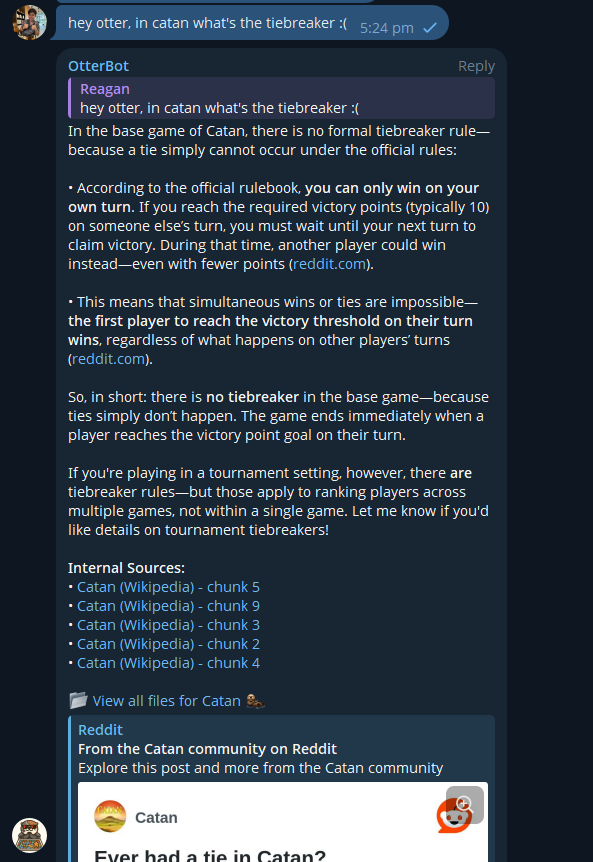
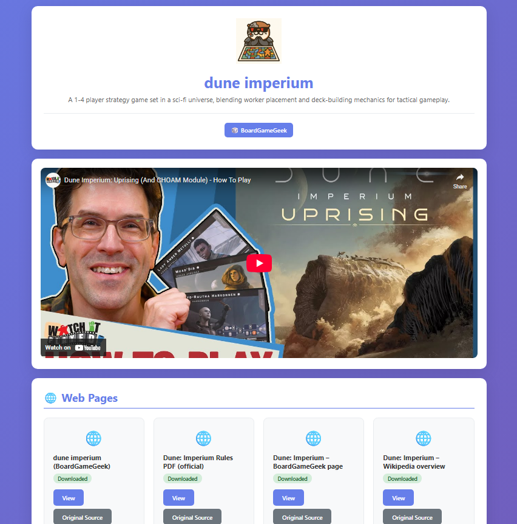
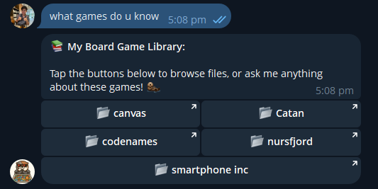
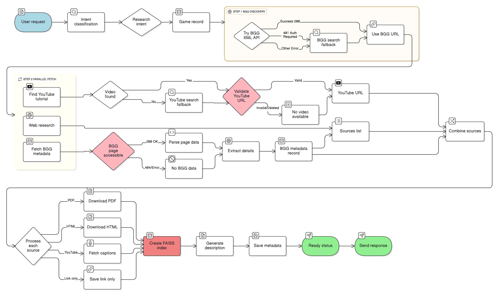
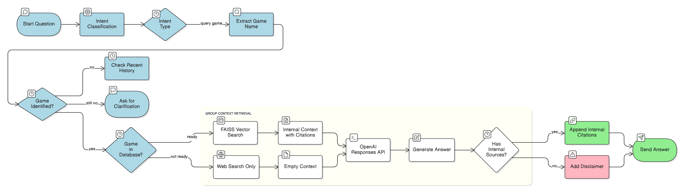

# Otterbot 🦦

A Telegram chatbot that serves as a board game assistant for the NCS MA boardgames group. It answers queries about board games, researches game rules from the web, and acts as a knowledgeable assistant during game sessions.

## Features

### Core Capabilities
- 🔍 **Research Mode**: Downloads and indexes game rules, PDFs, YouTube captions, and documentation from the web (up to 30 sources per game)<br>

- 💬 **Hybrid Q&A**: Combines internal knowledge base with live web search for comprehensive, up-to-date answers<br>

- 📚 **Web Interface**: Beautiful HTML interface to browse downloaded game resources with PDF previews<br>

- 🤖 **Agentic Routing**: AI-powered intent classification understands natural language queries
- 🎯 **Context-Aware**: Remembers conversation history to infer which game you're asking about<br>


## Quick Start

### Prerequisites

- Python 3.13+
- Poetry (for dependency management)
- Telegram bot token (from [@BotFather](https://t.me/botfather))
- OpenAI API key
- API Key from Google Console for Youtube

### Installation

```bash
# Clone the repository
git clone <repo-url>
cd otterbot

# Install dependencies
python3 -m venv venv
poetry install

# Activate virtual environment
source venv/bin/activate

# Create .env file with your credentials
cat > .env << EOF
OPENAI_API_KEY=
OTTER_BOT_TOKEN=
YOUTUBE_API_KEY=
STORAGE_DIR=storage
DATABASE_NAME=database
API_BASE_URL=http://localhost:8000
EOF
```

### Running the Bot

**Option 1: Run both services with one command (Recommended)**
```bash
bash scripts/start.sh
```

This starts:
- Telegram bot (listens for messages)
- FastAPI web server on `0.0.0.0:8000` (browse game files)

Press `Ctrl+C` to stop both services cleanly.

**Option 2: Run services separately**
```bash
# Terminal 1: Start the Telegram bot
python3 bot/main.py

# Terminal 2: Start the FastAPI server
uvicorn api.server:app --host 0.0.0.0 --port 8000 --reload
```

### Using the Bot

**In Group Chats** (requires "otter" in the first 2 words mentioned):
```
hey otter, research Catan
otter what games do you have?
otter how do you win in Wingspan?
```

**In Direct Messages** (no prefix needed):
```
research Catan
what games are available?
how do tiebreakers work in Catan?
```

**Available Commands:**
- **Research a game**: `otter research [game name]` - Downloads rules, PDFs, YouTube tutorials
- **Ask questions**: `otter [question about game]` - Answers using internal docs + web search
- **List games**: `otter what games do you have?` - Shows library with AI-generated descriptions
- **General chat**: `otter hello` - Friendly conversation

**Browse Files:**
- **In Telegram**: Use WebApp buttons sent by the bot (tap "📂 View [Game] Files")
- **In Browser**: Visit `http://your-server:8000/games/{game_id}/files` for a beautiful interface
- **Mobile-optimized**: 2 files per row on phones, responsive grid on larger screens

## How It Works

### Research Logic Flow

When you ask OtterBot to research a game (e.g., `otter research Catan`), here's what happens under the hood:



#### Key Steps Explained

1. **Intent Classification** (bot/otterrouter.py:60)
   - Uses GPT-4o-mini structured output to classify user intent
   - Extracts game name from natural language

2. **BGG URL Discovery** (bot/tools.py:118-165)
   - **First**: Try BGG XML API with `exact=1` parameter for better matching
   - **If 401**: BGG now requires authentication - falls back to Google search
   - **Google Fallback**: Searches `site:boardgamegeek.com/boardgame` for accurate URL

3. **Parallel Data Fetching** (bot/tools.py:390-418) - 3 concurrent tasks:
   - **Task 1 - Web Research**: OpenAI Responses API finds 20-30 authoritative sources
   - **Task 2 - BGG Metadata**: Fetches actual BGG page HTML, extracts 8000 chars including JSON-LD, LLM parses difficulty & player count
   - **Task 3 - YouTube**: Searches for tutorial, validates URL with oEmbed API, falls back to Google if needed

4. **YouTube Validation** (bot/tools.py:73-105, 425-431)
   - Uses YouTube oEmbed API to check if video exists
   - Filters out deleted/unavailable videos
   - Google search fallback if initial search fails

5. **Source Download & Processing** (bot/tools.py:244-361)
   - **PDFs**: Downloaded and stored as-is
   - **HTML Pages**: Downloaded + text extracted to companion .txt file
   - **YouTube Videos**: Captions fetched via YouTube Transcript API and saved as .txt
   - **External Links**: URL saved without download (for references, videos without captions)

6. **Vector Index Creation** (datasources/ingest.py)
   - All text files chunked into ~500-token segments
   - Embedded using OpenAI text-embedding-3-small
   - Stored in FAISS index for semantic search

7. **Metadata Enrichment** (bot/llms/openai.py:161-240, bot/tools.py:467-511)
   - LLM extracts **actual** difficulty score and player count from real BGG HTML content
   - Auto-generates 2-3 sentence game description from downloaded sources
   - Saves BGG URL (validated), YouTube link (validated), difficulty, player count, description

8. **Response** (bot/tools.py:525-561, bot/otterrouter.py:135-140)
   - Sends message with game description, metadata, and links
   - Includes difficulty, player count, YouTube tutorial, BGG link
   - Attaches WebApp button to browse files in Telegram
   - Updates game status to "ready"

### Query Logic Flow

When you ask a question about a game (e.g., `otter how do you win in Catan?`):



#### Query Steps Explained

1. **Game Name Extraction** (bot/tools.py:164-207)
   - LLM extracts game name from question
   - Fuzzy matches against available games (60% similarity threshold)
   - Falls back to recent chat history if no explicit mention

2. **Context Retrieval** (bot/tools.py:481-507)
   - If game is researched: FAISS semantic search for relevant chunks
   - Returns top 5 most relevant passages + source citations

3. **Hybrid Answer Generation** (bot/llms/openai.py:63-110)
   - OpenAI Responses API with web_search tool
   - Combines internal knowledge base + live web search
   - Ensures fresh, comprehensive answers

4. **Source Attribution** (bot/tools.py:566-600)
   - **Researched games**: Shows internal file citations + link to full file browser
   - **Non-researched games**: Adds disclaimer suggesting research for better results
   - All answers end with 🦦

## Development

### Code Quality

```bash
# Format and lint code
bash scripts/lint.sh

# Check only (no fixes)
bash scripts/lint.sh . --check

# Individual tools
ruff format .              # Format code
ruff check . --fix         # Lint and fix
mypy .                     # Type checking
```
## License

This project is licensed under the MIT License. 

Copyright (c) 2025 Reagan Chan <rrr.chanhiulok@gmail.com>

See the file for the full license text.


## Contributing

Contributions are welcome! Feel free to open issues or submit pull requests.
